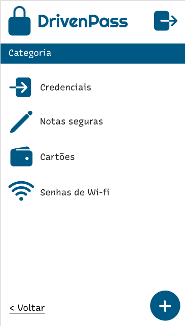

## Description

DrivenPass is a password manager back-end application, where the user can input, verify, and update passwords in different categories.

<p>
  
</p>

## Technologies Used

<p>


</p>

## Installation

```bash
$ npm install
```

## Running the app

```bash
# development
$ npm run start

# watch mode
$ npm run start:dev

# production mode
$ npm run start:prod
```

## Test

```bash
# unit tests
$ npm run test

# e2e tests
$ npm run test:e2e

```
